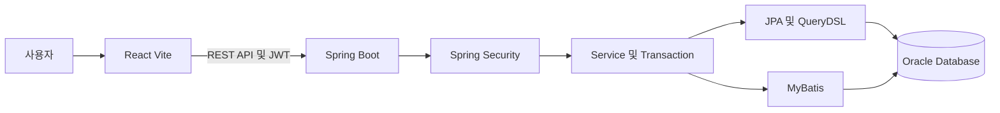

# 식자재 유통 물류 ERP

식자재 유통 과정에서 발생하는 기준정보, 구매, 입고, 재고, 판매, 출고 업무를 하나의 데이터 흐름으로 관리하는 ERP 프로젝트입니다.

업무 문서를 작성하는 시점과 실제 재고가 변경되는 시점을 분리하고, 모든 재고 변동을 이력으로 남기는 것을 핵심 원칙으로 삼았습니다. 또한 회사별 데이터 격리와 역할 기반 권한 검사를 적용하여 여러 사용자가 안전하게 업무를 처리할 수 있도록 구성했습니다.

## 프로젝트 목표

- 식자재 구매부터 판매와 출고까지 이어지는 업무 흐름 통합
- 상품별 LOT와 유통기한 관리
- 현재재고와 재고변경이력의 분리
- 입고확정과 출고확정 시점에만 재고 반영
- 회사별 업무 데이터 격리
- 역할과 세부 권한에 따른 화면 및 API 접근 제어
- 동시 출고 상황에서 재고 충돌과 음수재고 방지

## 주요 업무 흐름

```text
발주 등록
  → 승인 요청
  → 승인 또는 반려
  → 부분입고
  → 입고확정
  → LOT 및 현재재고 증가
  → 재고변경이력 기록

판매주문 등록
  → 출고 요청
  → 출고 가능한 LOT 조회
  → FEFO 기준 LOT 추천
  → 출고확정
  → LOT 및 현재재고 감소
  → 재고변경이력 기록
```

발주와 판매주문은 업무 요청을 기록하는 문서이며, 등록만으로 재고를 변경하지 않습니다. 재고는 입고확정 또는 출고확정이 완료되었을 때만 변경됩니다.

## 기능 구성

### 인증과 권한

- 로그인 ID와 비밀번호를 이용한 사용자 인증
- JWT Access Token 발급
- 로그인 사용자 및 회사 정보 조회
- ROLE과 PERMISSION을 이용한 세부 권한 관리
- 조회, 등록, 수정, 비활성화 권한 분리
- OWNER 계정의 역할 변경 및 삭제 방지
- 권한이 없는 요청에 `403 Forbidden` 응답
- 조회 권한이 없으면 관련 관리 화면 접근 차단
- 작업 권한이 없으면 해당 버튼 비활성화

### 기준정보

- 회사 관리
- 사용자 관리
- 거래처 관리
- 상품 관리
- 창고 관리
- 단위 관리
- 상품별 기준단위와 거래단위 관리
- 상품별 단위환산 관리

상품 수량은 서버에서 기준단위로 최종 환산하여 검증합니다. 예를 들어 `1 BOX = 48 EA`로 설정된 상품은 입고와 출고 수량을 기준단위 수량으로 변환하여 재고에 반영합니다.

### 구매와 입고

- 발주 Header와 Item 등록
- 발주 목록 및 상세 조회
- 발주 승인 요청, 승인, 반려
- 반려된 발주 수정
- 승인상태와 입고진행상태 분리
- 부분입고와 누적 입고수량 관리
- 미입고 잔량 계산
- 초과입고 방지
- 입고확정 전체 Transaction 처리

### 재고와 LOT

- 현재재고 조회
- LOT별 재고 관리
- 유통기한 관리
- 재고변경이력 조회
- 재고실사와 재고조정
- 전산수량, 실사수량, 차이수량 계산
- 조정사유, 처리자, 처리시간 기록
- 재고이력 Append Only 방식 적용

`STOCK`은 현재 수량을 나타내고, `STOCK_HISTORY`는 입고, 출고, 실사조정 등으로 발생한 변경 기록을 보관합니다. 기존 이력은 수정하거나 삭제하지 않고 새로운 기록을 추가하는 방식을 사용합니다.

### 판매와 출고

- 판매주문 Header와 Item 등록
- 판매주문 목록 및 상세 조회
- 출고 작성 및 확정
- 출고 가능한 LOT 조회
- FEFO 기준 LOT 추천
- LOT별 재고 차감
- 판매주문 상태 갱신
- 출고확정 전체 Transaction 처리

FEFO는 유통기한이 가장 가까운 재고부터 우선 출고하는 방식입니다. 현재 MVP에서는 서버가 출고 가능한 LOT를 유통기한순으로 추천하고, 담당자가 최종 LOT를 선택합니다.

## 핵심 업무 규칙

1. 발주 등록과 승인만으로 재고를 증가시키지 않습니다.
2. 입고 작성 중에는 재고를 변경하지 않습니다.
3. 입고확정 시 현재재고 증가와 재고이력 생성을 함께 처리합니다.
4. 판매주문 등록만으로 재고를 감소시키지 않습니다.
5. 출고 작성 중에는 재고를 변경하지 않습니다.
6. 출고확정 시 현재재고와 LOT 재고를 감소시키고 재고이력을 생성합니다.
7. 재고가 부족한 경우 출고확정을 거부합니다.
8. 모든 업무 데이터는 로그인 사용자의 회사 범위에서만 조회하고 변경합니다.
9. 입고확정, 출고확정, 재고조정은 하나의 Transaction으로 처리합니다.
10. JWT 만료시간은 절대시간을 사용하고, 업무 일시는 Asia Seoul 기준으로 저장합니다.

## 시스템 구성



## 기술 구성

### Frontend

| 기술 | 사용 목적 |
| --- | --- |
| React | 관리 화면과 입력 폼 구성 |
| Vite | 프론트엔드 개발 서버와 빌드 |
| React Router | 로그인 및 업무 화면 경로 관리 |
| Fetch API | 백엔드 REST API 호출 |
| Lucide React | 화면 아이콘 구성 |

### Backend

| 기술 | 사용 목적 |
| --- | --- |
| Java | 서버 애플리케이션 구현 |
| Spring Boot | REST API와 업무 서비스 구성 |
| Spring Security | 인증과 API 권한 검사 |
| JWT | 로그인 사용자와 회사 및 권한 전달 |
| JPA | 업무 데이터 등록, 수정, 상태 변경 |
| Query Method | 단순한 단건 조회 |
| JPQL | 조건이 비교적 고정된 목록 조회 |
| QueryDSL | 기간, 상태, 거래처 등 복합 검색 |
| MyBatis | SQL 중심의 조회와 집계 |
| Transaction | 재고와 이력 변경의 원자성 보장 |

### Database

| 기술 | 사용 목적 |
| --- | --- |
| Oracle Database | 업무 데이터 저장 |
| Oracle Autonomous Database | 공용 개발 데이터베이스 운영 |
| SQL Migration 파일 | 스키마 변경 내역 공유 및 관리 |

## 프로젝트 구조

```text
2026-school-final-project
├── back
│   ├── src/main/java
│   │   └── com.foodlogistics.erp
│   ├── src/main/resources
│   │   ├── mapper
│   │   └── db/migration
│   └── build.gradle
│
└── front
    └── finalProjectFront
        ├── src
        │   ├── api
        │   ├── components
        │   └── pages
        └── package.json
```

실제 패키지와 폴더 구조는 개발 브랜치에 따라 일부 달라질 수 있습니다.

## 실행 환경

- JDK 25 또는 프로젝트에서 지정한 호환 JDK
- Node.js와 npm
- Oracle Database 또는 프로젝트에서 제공하는 로컬 데이터베이스
- Docker Desktop은 로컬 데이터베이스를 Docker로 실행할 때 필요

## 환경변수

백엔드 실행 전에 다음 값을 환경변수로 설정합니다.

```bash
export DB_URL='jdbc:oracle:thin:@...'
export DB_USERNAME='...'
export DB_PASSWORD='...'
export JWT_SECRET='충분히 길고 외부에 공개되지 않은 값'
```

환경변수 이름은 현재 `application.yml` 또는 `application.properties` 설정에 맞춰야 합니다.

> 비밀번호, JWT 비밀키, Oracle 접속 문자열과 같은 민감정보는 Git 저장소에 커밋하지 않습니다.

## 로컬 실행 방법

### 1. 데이터베이스 준비

Oracle 접속 정보를 환경변수에 등록합니다. 로컬 데이터베이스를 Docker로 실행하는 구성이라면 먼저 Docker Desktop과 데이터베이스 컨테이너를 실행합니다.

스키마와 기본 데이터가 준비되지 않으면 로그인이나 기준정보 조회가 실패할 수 있습니다.

### 2. Backend 실행

```bash
cd back
sh ./gradlew bootRun
```

기본 주소는 다음과 같습니다.

```text
http://localhost:8080
```

### 3. Frontend 실행

```bash
cd front/finalProjectFront
npm install
npm run dev
```

기본 주소는 다음과 같습니다.

```text
http://localhost:5173
```

### 4. 로그인 확인

```bash
curl -X POST http://localhost:8080/api/auth/login \
  -H 'Content-Type: application/json' \
  -d '{
    "loginId": "사용자 ID",
    "password": "비밀번호"
  }'
```

발급된 토큰은 이후 요청의 `Authorization` 헤더에 전달합니다.

```text
Authorization: Bearer ACCESS_TOKEN
```

## 주요 API 예시

| Method | Endpoint | 설명 |
| --- | --- | --- |
| POST | `/api/auth/login` | 로그인과 Access Token 발급 |
| GET | `/api/auth/me` | 현재 로그인 사용자와 권한 조회 |
| GET | `/api/management/products` | 상품 관리 목록 조회 |
| GET | `/api/business-partners` | 거래처 목록 조회 |
| GET | `/api/management/warehouses` | 창고 목록 조회 |
| GET | `/api/units` | 단위 목록 조회 |
| GET | `/api/management/products/{productId}/units` | 상품별 단위 조회 |

API 요청과 응답 규격은 각 기능의 Controller와 별도 API 문서를 기준으로 확인합니다.

### 성공 응답 형식

```json
{
  "data": {},
  "success": true
}
```

### 실패 응답 형식

```json
{
  "error": {
    "code": "ERROR_CODE",
    "message": "오류 메시지"
  },
  "success": false
}
```

## 빌드와 테스트

### Backend 전체 테스트

```bash
cd back
sh ./gradlew test
```

### Backend 컴파일 확인

```bash
cd back
sh ./gradlew compileJava
```

### Frontend 빌드 확인

```bash
cd front/finalProjectFront
npm run build
```

## 권한 처리 기준

- 조회 권한이 없으면 해당 관리 화면을 표시하지 않고 권한 없음 화면을 보여줍니다.
- 등록, 수정, 비활성화 권한이 없으면 관련 버튼을 비활성화합니다.
- 프론트엔드의 버튼 제어와 별도로 백엔드 API가 최종 권한을 다시 검사합니다.
- 조회 권한이 없는 사용자는 같은 업무의 등록, 수정, 비활성화 권한도 사용할 수 없습니다.
- OWNER 계정은 시스템 보호 대상으로 취급하여 역할 변경과 삭제를 차단합니다.

## 데이터와 시간 처리

- 업무 일시 기준은 `Asia/Seoul`입니다.
- Oracle 기본시간과 Java 시간이 섞이지 않도록 DB 기본값과 애플리케이션 시간을 동일 기준으로 사용합니다.
- JWT의 발급시간과 만료시간은 인증용 절대시간이므로 `Instant` 기준을 유지합니다.
- 기존 데이터에 UTC와 KST가 혼재할 수 있으므로 검증 없이 전체 데이터를 일괄 보정하지 않습니다.

## 개발 시 주의사항

- 다른 회사의 데이터를 ID만 변경하여 조회하거나 수정할 수 없도록 `companyId`를 항상 함께 검증합니다.
- Mapper SQL에서 회사 조건이 누락되지 않았는지 확인합니다.
- 입고확정과 출고확정 로직에서 재고수량과 이력 저장을 분리 실행하지 않습니다.
- 재고 수량을 직접 덮어쓰지 않고 재고조정 업무와 이력을 통해 변경합니다.
- 공용 Oracle DB 스키마는 담당자 협의 없이 개별 수정하지 않습니다.
- Migration 파일 번호는 팀에서 정한 범위를 지켜 충돌을 방지합니다.

## 팀 역할

| 담당 | 주요 범위 |
| --- | --- |
| 팀원A | 구매, 발주, 승인, 부분입고, 입고확정 |
| 팀원B | 공통 기반, 회사, 사용자, 보안, 권한, 기준정보 |
| 팀원C | 재고, LOT, 재고실사, 판매주문, FEFO, 출고 |
| 팀원D | Header, Footer 및 초기 공통 화면 디자인 |

실제 이름과 세부 역할은 최종 제출 전에 팀 구성에 맞게 수정합니다.

## 라이선스

교육용 팀 프로젝트입니다. 외부 배포 및 상업적 사용 여부는 팀 협의에 따릅니다.
